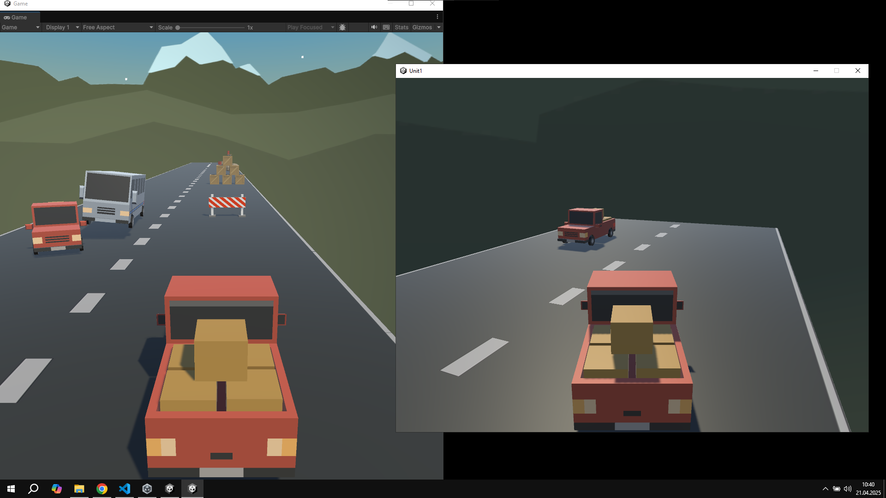

# 🚗 Speed_Zone

**Speed_Zone**, Unity ile geliştirilmiş bir **multiplayer yarış oyunu denemesidir**.  
Bu proje, Unity'nin **Netcode for GameObjects** sistemi kullanılarak çok oyunculu oyun geliştirme üzerine bir deneme olarak hazırlanmıştır.

## 🎮 Özellikler

- Gerçek zamanlı çok oyunculu oynanış (Multiplayer denemesi)
- Hız kurallarına göre tasarlanmış basit bir yarış sistemi
- Unity Netcode altyapısıyla oyuncular arası bağlantı

## 🖼️ Görseller

 <!-- Buraya görselin linkini ekleyebilirsin -->

## 🔧 Kullanılan Teknolojiler

- Unity
- Netcode for GameObjects (Unity Multiplayer)
- C#

## 📝 Not

Bu proje, **Unity'de multiplayer sistemleri öğrenmek amacıyla geliştirilmiş basit bir prototiptir.**

---

> Geri bildirim ve katkılarınız memnuniyetle karşılanır!
